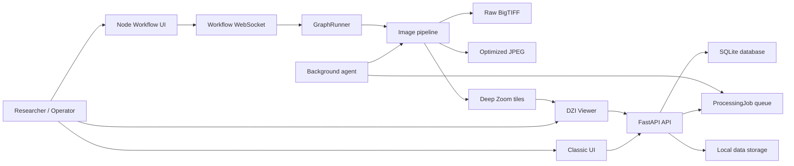

# Gigapixel Heritage Viewer

## 과제 요약

Gigapixel Heritage Viewer는 복합소재 문화유산의 고품질 디지털 획득, 정합, 검수, 공유를 지원하기 위한 연구용 로컬 웹 기반 플랫폼입니다. 본 프로젝트는 다중 고해상도 촬영 이미지를 원본 해상도 중심으로 스티칭하고, BigTIFF 원본 결과물과 웹 열람용 Deep Zoom 타일을 생성하여 연구자, 복원 전문가, 데이터 구축 담당자가 대형 문화유산 이미지 데이터를 검토하고 주석화할 수 있도록 설계되었습니다.

특히 30,000 x 30,000 픽셀 이상의 기가픽셀급 이미지와 20-50장 이상의 다중 입력 이미지셋을 다루는 문화유산 획득 환경을 주요 대상으로 하며, PTGui 수준의 전역 정합 품질에 가까워지기 위한 단계형 이미지 처리 파이프라인, 작업 큐 기반 처리 agent, 노드형 워크플로우 UI, 원본 BigTIFF 다운로드, 최적화 버전 다운로드, DZI 기반 웹 뷰어를 통합하는 것을 목표로 합니다.

Research-oriented local web application for high-resolution cultural heritage image stitching, BigTIFF export, Deep Zoom tiling, web-based inspection, annotation, and node-style workflow control.

This project is designed for digital heritage acquisition and restoration workflows where source images can reach tens of thousands of pixels per side. The current focus is a local, reproducible research environment rather than a hosted multi-tenant service.

## Highlights

- Multi-image upload and session-based processing.
- Scans-oriented stitching pipeline for flat or near-planar cultural heritage captures.
- OpenCV-based feature detection, pair matching, global alignment, warping, seam handling, and blending.
- Raw high-resolution output as BigTIFF.
- Optimized JPEG output for smaller distribution workflows.
- Deep Zoom Image generation for web-scale viewing.
- OpenSeadragon viewer with pan, zoom, annotations, and downloads.
- Classic form-based UI for simple operation.
- Node-style workflow UI inspired by ComfyUI, n8n, Unreal Blueprint, and agent monitoring consoles.
- Background processing agent for queued long-running jobs.
- Structured JSON logging and initial unit tests.

## Project Status

This repository is an active research and engineering prototype.

It is suitable for:

- Local research experiments.
- Cultural heritage image acquisition workflow prototyping.
- Stitching pipeline development.
- Viewer and annotation workflow evaluation.
- BigTIFF and DZI output experiments.

It is not yet production-complete for:

- Public internet exposure.
- Multi-user authentication and authorization.
- Guaranteed recovery from all worker crashes.
- Fully streaming gigapixel compositing without large in-memory arrays.
- Large-scale distributed queue execution.

See:

- [`docs/CODEBASE_KNOWLEDGE.md`](docs/CODEBASE_KNOWLEDGE.md)
- [`docs/ACQUISITION_PROTOCOL.md`](docs/ACQUISITION_PROTOCOL.md)
- [`docs/ARCHITECTURE_AUDIT.md`](docs/ARCHITECTURE_AUDIT.md)
- [`docs/REFACTOR_PLAN.md`](docs/REFACTOR_PLAN.md)
- [`docs/REFACTOR_SUMMARY.md`](docs/REFACTOR_SUMMARY.md)
- [`docs/TESTING_GUIDE.md`](docs/TESTING_GUIDE.md)

## Architecture Overview



Important runtime distinction:

- Classic UI processing uses the queue and `app.agent`.
- Node workflow processing currently runs through the WebSocket graph runner. The refactor roadmap moves this onto the same queue model.

## Repository Layout

```text
gigapixel-heritage-viewer/
  app/
    agent.py                  # Background job worker
    config.py                 # Settings loaded from defaults and .env
    database.py               # SQLAlchemy engine/session setup
    errors.py                 # Shared application exception hierarchy
    logging_config.py         # Structured logging setup
    main.py                   # FastAPI app and route registration
    models.py                 # SQLAlchemy ORM models
    schemas.py                # Pydantic API schemas
    services/
      blending.py             # Exposure compensation, seams, blending
      deepzoom.py             # DZI tile generation
      exporter.py             # Download path and filename handling
      feature_matching.py     # EXIF correction, SIFT/ORB, pair matching
      global_alignment.py     # Match graph and global affine optimization
      jobs.py                 # Queue coordination boundary
      node_runner.py          # Node graph execution
      stitch_pipeline.py      # Scans-mode pipeline orchestration
      stitching.py            # Public stitch API and output writers
      storage.py              # Runtime storage paths
      tiling.py               # Canvas and pixel-limit utilities
      warping.py              # Full-resolution warp planning
    static/                   # Browser-side JS/CSS
    templates/                # Jinja templates
  data/                       # Runtime database, uploads, sessions, outputs
  docs/                       # Architecture, audit, refactor, testing docs
  tests/                      # Unit tests
  requirements.txt
  run_api.ps1
  run_agent.ps1
  open_agent_window.ps1
```

## Requirements

- Windows with Python 3.11+ recommended.
- Python launcher `py` available on Windows.
- OpenCV-compatible CPU environment.
- Optional but strongly recommended for gigapixel DZI generation: libvips and `pyvips`.

Python packages are listed in `requirements.txt`.

## Installation

Create and activate a virtual environment:

```powershell
py -3 -m venv .venv
.\.venv\Scripts\Activate.ps1
```

Install dependencies:

```powershell
py -3 -m pip install --upgrade pip
py -3 -m pip install -r requirements.txt
```

If `pip` is not recognized in Git Bash or PowerShell, use:

```powershell
py -3 -m pip install -r requirements.txt
```

## Running The Application

Start the API server:

```powershell
py -3 -m uvicorn app.main:app --host 127.0.0.1 --port 8000 --reload
```

Start the background agent in a second terminal:

```powershell
py -3 -m app.agent
```

PowerShell helper scripts:

```powershell
.\run_api.ps1
.\run_agent.ps1
.\open_agent_window.ps1
```

The agent emits structured JSON logs. Example:

```json
{"level":"INFO","logger":"app.agent","message":"agent job processing","job_id":1,"session_id":"...","mode":"scans"}
```

## URLs

| Page or endpoint | URL |
| --- | --- |
| Classic UI | `http://127.0.0.1:8000/` |
| Classic UI explicit route | `http://127.0.0.1:8000/classic` |
| Expert node workflow UI | `http://127.0.0.1:8000/workflow` |
| Viewer | `http://127.0.0.1:8000/viewer/{session_id}` |
| Raw download | `/api/sessions/{session_id}/download/raw` |
| Optimized download | `/api/sessions/{session_id}/download/optimized` |
| DZI descriptor | `/api/sessions/{session_id}/dzi` |

## Typical Workflow

1. Start the API server.
2. Start the agent in a separate terminal.
3. Open `http://127.0.0.1:8000/`.
4. Create a session and upload at least two images.
5. Select `scans` for flat/document-style captures or `panorama` for scene panoramas.
6. Submit processing.
7. Wait for the session to become `ready`.
8. Open the viewer and inspect the DZI output.
9. Download raw BigTIFF or optimized JPEG.

## Image Pipeline

The scans-mode pipeline is decomposed into explicit stages:

```mermaid
flowchart TD
  input["Source images"] --> validate["Validate dimensions and EXIF orientation"]
  validate --> features["Build preview features with SIFT or ORB"]
  features --> match["Pairwise descriptor matching"]
  match --> ransac["RANSAC transform estimation"]
  ransac --> graph["Overlap graph and root selection"]
  graph --> align["Global alignment"]
  align --> warp["Full-resolution warp planning"]
  warp --> blend["Exposure, seam, and blending"]
  blend --> export["BigTIFF and optimized JPEG export"]
  export --> dzi["DZI tile generation"]
```

Registration can use downscaled previews. Final warping and compositing are intended to preserve source-resolution pixels. The current implementation still contains full-array stages, so memory planning is important for very large outputs.

## Configuration

Configuration is loaded from `app/config.py` and can be overridden with `.env`.

Example:

```env
MAX_SOURCE_PIXELS=15000000000
OPTIMIZED_JPEG_QUALITY=85
STITCH_FEATURE_DETECTOR=sift
STITCH_PLANAR_PREVIEW_MAX_DIM=2200
STITCH_PLANAR_TRANSFORM_MODEL=affine
LOG_LEVEL=INFO
LOG_FORMAT=json
```

Important settings:

| Setting | Default | Description |
| --- | --- | --- |
| `MAX_SOURCE_PIXELS` | `10000000000` | Explicit pixel limit used by processing and DZI generation |
| `MAX_UPLOAD_FILES` | `1000` | Maximum files per upload request |
| `OPTIMIZED_JPEG_QUALITY` | `85` | JPEG quality for optimized output |
| `RAW_STITCHED_FORMAT` | `bigtiff` | Raw output target |
| `RAW_BIGTIFF_COMPRESSION` | `none` | BigTIFF compression mode |
| `STITCH_FEATURE_DETECTOR` | `sift` | Feature detector, usually `sift` or `orb` |
| `STITCH_PLANAR_TRANSFORM_MODEL` | `affine` | Alignment model for scans |
| `STITCH_PLANAR_MULTIBAND_MAX_PIXELS` | `120000000` | Multiband blend cutoff before streaming feather fallback |
| `LOG_FORMAT` | `json` | Agent/API log format |

## Data And Outputs

Runtime files are stored under `data/`:

```text
data/
  gigapixel.db
  node_uploads/
  sessions/
    {session_id}/
      uploads/
      output/
        stitched_raw.tif
        stitched_optimized.jpg
        dzi/
          image.dzi
          image_files/
```

`data/node_uploads/` and `data/sessions/` are runtime artifacts and should not be committed.

## Testing

Install dependencies first:

```powershell
py -3 -m pip install -r requirements.txt
```

Run tests:

```powershell
$env:PYTHONDONTWRITEBYTECODE='1'
py -3 -m pytest -q
```

Current baseline:

```text
6 passed
```

See [`docs/TESTING_GUIDE.md`](docs/TESTING_GUIDE.md).

## Development Notes

To keep the project maintainable:

- Keep route handlers thin.
- Put business logic in services.
- Put queue coordination in `JobService`.
- Keep image-pipeline stages explicit and testable.
- Avoid adding new node behavior directly into a large conditional chain when possible.
- Prefer structured logs over `print()`.
- Avoid committing runtime data, generated tiles, image outputs, and bytecode caches.

## Known Limitations

- Node workflow execution does not yet share the same queue model as classic processing.
- Processing jobs do not yet have heartbeat, worker identity, stale recovery, or retry policy.
- Very large BigTIFF workflows can still hit memory limits because some stages use full in-memory arrays.
- Pillow DZI fallback is not appropriate for true gigapixel-scale production use. Use pyvips/libvips where possible.
- Authentication and authorization are not implemented.
- External browser libraries are currently loaded from CDNs.

## Roadmap

Near-term engineering priorities:

1. Add job heartbeat, stale recovery, retry policy, and queue position reporting.
2. Split `app.main` into routers and application services.
3. Move node workflow pipeline execution onto the same queue used by classic mode.
4. Refactor `GraphRunner` into a node executor registry.
5. Add streaming/tiled BigTIFF writing and pyvips-first DZI generation for large outputs.
6. Add API integration tests and synthetic stitching smoke tests.
7. Add deployment documentation for libvips, Windows, and offline static assets.

## Troubleshooting

### `pip: command not found`

Use the Python launcher:

```powershell
py -3 -m pip install -r requirements.txt
```

### Session remains queued

Confirm the agent is running in a second terminal:

```powershell
py -3 -m app.agent
```

If no agent is running, queued jobs will not start.

### OpenCV OpenCL allocation failure

The code disables OpenCL before stitching. If allocation failures continue, reduce concurrent workload, close memory-heavy applications, and prefer smaller test batches while the streaming compositor is being developed.

### DZI generation is slow or memory-heavy

Install libvips and enable `pyvips`. Pillow fallback is only a fallback and is not recommended for very large images.

## License

No open-source license file is currently present. Add a `LICENSE` file before publishing this repository as a public open-source project.

## Research Acknowledgement

본고는 문화체육관광부 및 한국콘텐츠진흥원(KOCCA)의 2024년도 문화체육관광연구개발사업으로 수행되었음. 과제명: 복합소재 문화유산 고품질 복원을 위한 디지털 문화유산 획득용 광학기술 및 공유 플랫폼 기술 개발 과제번호: RS-2024-00442410


