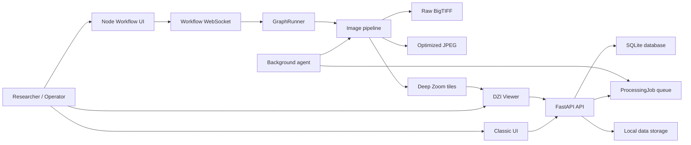

# Hyper Gigapixel Agent

> 하이퍼 기가픽셀 에이전트 — 기가픽셀 문화유산 획득·정합·복원·3D·공유를 위한 에이전트형 인텔리전스 플랫폼 (구 *Gigapixel Heritage Viewer*).

## 과제 요약

Hyper Gigapixel Agent(하이퍼 기가픽셀 에이전트)는 복합소재 문화유산의 고품질 디지털 획득, 정합, 검수, 공유를 지원하기 위한 연구용 로컬 웹 기반 플랫폼입니다. 본 프로젝트는 다중 고해상도 촬영 이미지를 원본 해상도 중심으로 스티칭하고, BigTIFF 원본 결과물과 웹 열람용 Deep Zoom 타일을 생성하여 연구자, 복원 전문가, 데이터 구축 담당자가 대형 문화유산 이미지 데이터를 검토하고 주석화할 수 있도록 설계되었습니다.

특히 30,000 x 30,000 픽셀 이상의 기가픽셀급 이미지와 최소2장, 기본20-50장 그 이상의 ㄱ다중 입력 이미지셋을 다루는 문화유산 획득 환경을 주요 대상으로 하며, PTGui 수준의 전역 정합 품질에 가까워지기 위한 단계형 이미지 처리 파이프라인, 작업 큐 기반 처리 agent, 노드형 워크플로우 UI, 원본 BigTIFF 다운로드, 최적화 버전 다운로드, DZI 기반 웹 뷰어를 통합하는 것을 목표로 합니다.

Research-oriented local web application for high-resolution cultural heritage image stitching, BigTIFF export, Deep Zoom tiling, web-based inspection, annotation, and node-style workflow control.

This project is designed for digital heritage acquisition and restoration workflows where source images can reach tens of thousands of pixels per side. The current focus is a local, reproducible research environment rather than a hosted multi-tenant service.

## Highlights

- Multi-image upload and session-based processing.
- Scans-oriented stitching pipeline for flat or near-planar cultural heritage captures.
- OpenCV-based feature detection, pair matching, global alignment, warping, seam handling, and blending.
- Optional AI / learned feature matching (LoFTR, LightGlue) for high-accuracy registration on low-texture heritage surfaces, with automatic fallback to classical SIFT/ORB.
- Robust global bundle adjustment (iteratively reweighted Huber least squares) for globally consistent alignment.
- Focus-robust registration: per-image sharpness normalization for consistent keypoints, plus optical-flow elastic overlap alignment that removes the ghosting/"breaking" caused by focus or detected-point mismatch.
- Interactive local upscaling: pick a factor on the finished mosaic and run a high-quality upscale (ComfyUI Flux / diffusers SD-x4 / Real-ESRGAN / Lanczos).
- Tiled multi-band blending that preserves multi-band quality at gigapixel scale instead of degrading to feather compositing.
- Automatic output quality control (interior-hole, coverage, sharpness, seam, registration, and learned no-reference quality checks) with an `ok`/`warn`/`broken` verdict and a `quality_report.json` sidecar.
- Automatic repair of enclosed holes via inpainting (optional LaMa deep backend, classical fallback).
- Deep retrieval-based overlap graph (DINOv2 embeddings) for robust matching of large unordered image sets.
- SAM-assisted smart annotation and crack/damage detection in the viewer (GrabCut fallback when SAM weights are absent).
- Optional AI output enhancement (Real-ESRGAN super-resolution / denoise) as a non-archival viewing variant.
- Archival-science layer: colour calibration with CIE dE2000 + FADGI/Metamorfoze grading, measured-vs-reconstructed provenance/uncertainty maps, dimensional scale calibration, focus stacking, multi-temporal change detection, photometric-stereo surface normals, a SHA-256 processing manifest, and IIIF output.
- "HYPER·GIGA" 3D/glass UI theme with an ambient animated background.
- Live **IIIF Image API 3.0** server (region/size/rotation/quality/format) — standard for global heritage institutions (Mirador / Universal Viewer).
- **AI condition analysis** of cracks (Hessian ridge) and discolouration (CIELAB anomaly: yellowing / fading / staining).
- **AI restoration** (de-colour, de-crack, de-noise) with a Before/After comparison slider.
- **Image-to-3D** — monocular-depth-lifted point cloud and 3D Gaussian Splatting (`.ply`) with a WebGL 3D explorer.
- **Multi-view 3D reconstruction** — registers all views and fuses them (COLMAP + gsplat when available, depth-fusion fallback).
- **Robust job queue** — worker leases, heartbeats, automatic stale recovery, retries, and queue-position reporting.
- **Corpus semantic search + auto-tagging** (CLIP / classical) across sessions.
- **Acquisition coverage QA** — overlap-graph connectivity check with recommendations before stitching.
- **Streaming gigapixel compositor** (disk-backed canvas) and **optional API-key authentication**.
- **Generative outpainting** to fill a rotated mosaic's empty borders or extend the field of view (ComfyUI Flux Fill / diffusers / classical), emitted as a non-archival variant with the generated pixels flagged.
- Raw high-resolution output as BigTIFF.
- Optimized JPEG output for smaller distribution workflows.
- Deep Zoom Image generation for web-scale viewing.
- OpenSeadragon viewer with pan, zoom, annotations, and downloads.
- Classic form-based UI for simple operation.
- Node-style workflow UI inspired by ComfyUI, n8n, Unreal Blueprint, and agent monitoring consoles.
- Background processing agent for queued long-running jobs.
- Structured JSON logging and initial unit tests.

## Update Notes — Accuracy Upgrade (2026-06)

This release reworks the stitching core for the highest achievable synthesis
accuracy on cultural-heritage captures. Everything degrades gracefully: the
classical pipeline still runs unchanged when the optional AI stack is absent.

### Added

1. **AI / learned feature matching** ([`app/services/deep_matching.py`](app/services/deep_matching.py)).
   New LoFTR (detector-free dense matching) and LightGlue (DISK / ALIKED / SIFT)
   backends produce far more reliable correspondences on the low-texture,
   self-similar surfaces typical of paintings, textiles, ceramics, and stone.
   Selected with `STITCH_MATCHER` (`auto` prefers LoFTR when `torch` + `kornia`
   are available). GPU is auto-detected via `STITCH_MATCHER_DEVICE`.
2. **Robust global bundle adjustment** ([`global_alignment.py`](app/services/global_alignment.py)).
   The single linear affine solve is now wrapped in iteratively reweighted least
   squares with a Huber loss, progressively downweighting outlier
   correspondences for globally consistent alignment. Always on, no extra
   dependencies (`STITCH_PLANAR_ROBUST_REFINE`).
3. **Tiled multi-band blending for gigapixel canvases** ([`blending.py`](app/services/blending.py)).
   Canvases above the in-memory cutoff previously degraded to feather
   compositing. They now use global Brown–Lowe gain compensation plus per-tile
   multi-band blending with distance-transform seam masks — verified seamless
   across tile boundaries (`STITCH_PLANAR_TILED_MULTIBAND`).
4. **Lens distortion correction** ([`lens_correction.py`](app/services/lens_correction.py)).
   Optional radial/tangential undistortion applied identically to every source
   before registration, removing seam "bow" that affine/homography cannot model.
   Manual coefficients or automatic EXIF lookup via optional `lensfunpy`
   (`STITCH_LENS_CORRECTION`). Disabled by default.
5. **Tiled BigTIFF output** ([`stitching.py`](app/services/stitching.py)).
   Raw output is written as a tiled BigTIFF for efficient partial reads by
   pyvips DZI generation, OpenSeadragon, and GIS tools (`RAW_BIGTIFF_TILED`).
6. **Output quality control** ([`quality.py`](app/services/quality.py)).
   Every finished mosaic is inspected for interior holes, low coverage, blur,
   prominent seams/tears, and high registration RMS, and is classified as
   `ok` / `warn` / `broken`. The full report — metrics plus located defect
   regions — is written to `output/quality_report.json` and served at
   `GET /api/sessions/{id}/quality` (`STITCH_QUALITY_CHECK`).
7. **Automatic repair of broken regions** ([`repair.py`](app/services/repair.py)).
   Enclosed holes (gaps surrounded by content, so they cannot be the mosaic's
   outer background) are reconstructed by inpainting before the outputs are
   saved. Uses the LaMa deep model when the optional
   `simple-lama-inpainting` package is installed, otherwise classical Telea
   inpainting (`STITCH_AUTO_REPAIR`, `STITCH_REPAIR_BACKEND`). Exterior corners
   of rotated mosaics and holes too large to reconstruct are left untouched.

### Changed

- Registration preview resolution raised from 2200 px to 3200 px
  (`STITCH_PLANAR_PREVIEW_MAX_DIM`); match-sample budget raised to 800.
- Classical and learned matching now share one geometric verifier
  (`build_pair_match`), so both paths get identical RANSAC validation.
- AI packages (`torch`, `kornia`) are now listed in `requirements.txt` (CPU
  build by default; use `requirements-ai.txt` for a CUDA build).

### Verification

- Test suite: **14 passed** (was 6), including new synthetic checks for robust
  pair estimation, seamless multi-tile blending, lens-correction behavior, and
  tiled-TIFF geometry ([`tests/test_stitch_accuracy.py`](tests/test_stitch_accuracy.py)).
- End-to-end stitching validated on sample image sets through both the in-memory
  multi-band and forced tiled multi-band paths.

### Enable maximum accuracy

```powershell
py -3 -m pip install -r requirements.txt   # includes torch + kornia (CPU)
Copy-Item .env.example .env                 # max-accuracy preset
```

With an NVIDIA GPU, install a CUDA torch build first (see `requirements-ai.txt`)
and set `STITCH_MATCHER_DEVICE=cuda`. The robust bundle adjustment, higher-
resolution registration, and tiled multi-band blending are active by default
even without the AI stack installed.

## Update Notes — AI Capability Pack

Four additional AI capabilities, each with an always-available classical
fallback (no hard dependency on the deep models):

1. **Deep retrieval overlap graph** ([`retrieval.py`](app/services/retrieval.py)).
   For large, *unordered* sets, candidate image pairs are chosen by global
   descriptor similarity (DINOv2 via `transformers`, or a classical thumbnail
   embedding) instead of a sequential-neighbour guess, so the overlap graph is
   correct regardless of capture order. Strategy: `STITCH_PAIR_SELECTION`.
2. **Learned no-reference quality** ([`iqa.py`](app/services/iqa.py)).
   QC gains a perceptual quality score — CLIP-IQA via the optional `pyiqa`
   package, or a sharpness/contrast/colourfulness heuristic. Only the learned
   score gates the verdict; the heuristic is reported as an informational
   metric (`STITCH_QUALITY_IQA`).
3. **SAM smart annotation** ([`segmentation.py`](app/services/segmentation.py)).
   `POST /api/sessions/{id}/segment` returns the outline of the object under a
   click (Segment Anything when `SAM_CHECKPOINT` is set, GrabCut otherwise);
   `POST /api/sessions/{id}/detect-damage` finds crack/damage-like structures.
   The viewer adds a "Smart annotate" toggle (or Shift+Click) and a
   "Detect damage" button that draw outlines over the mosaic.
4. **AI output enhancement** ([`enhance.py`](app/services/enhance.py)).
   An optional non-archival enhanced variant (`stitched_enhanced.jpg`,
   `GET .../download/enhanced`) via Real-ESRGAN super-resolution, or Lanczos +
   denoise + unsharp as fallback. Generative, so OFF by default
   (`STITCH_ENHANCE`).

Optional installs (any subset; everything degrades gracefully without them):

```powershell
py -3 -m pip install transformers          # DINOv2 retrieval embeddings
py -3 -m pip install pyiqa                  # CLIP-IQA learned quality score
py -3 -m pip install segment-anything       # SAM (also set SAM_CHECKPOINT)
py -3 -m pip install realesrgan             # Real-ESRGAN enhancement
```

Verification: test suite **24 passed**, including AI-feature fallback tests
(retrieval pairing of shuffled duplicates, IQA ordering, click-segmentation,
damage detection, enhancement scaling) in
[`tests/test_ai_features.py`](tests/test_ai_features.py).

## Update Notes — Archival Science Pack & HYPER·GIGA UI

Turns the stitching engine into an archival-grade acquisition platform, and
re-skins the app as a 3D/glass "HYPER·GIGA" product. Each capability has a working
classical implementation; deep/optional paths upgrade it when available.

1. **Colour / radiometric calibration** ([`color.py`](app/services/color.py)).
   Detects a 24-patch ColorChecker (OpenCV `mcc`), fits a colour-correction
   matrix, and reports CIE **dE2000** graded against **FADGI / Metamorfoze**
   tolerances; gray-world white balance when no target is present. Writes
   `color_report.json` and colour-manages every saved variant.
2. **Provenance / uncertainty layers** ([`provenance.py`](app/services/provenance.py)).
   Ancillary `coverage` / `synthetic` / `uncertainty` PNGs so reconstructed
   (inpainted) pixels are never mistaken for measurements — the repair stage now
   returns an explicit synthetic-pixel mask.
3. **Processing manifest + fixity + metadata** ([`manifest.py`](app/services/manifest.py)).
   `processing_manifest.json` records parameters, library versions, inputs and
   **SHA-256** of every artefact, plus a Dublin Core sidecar — reproducible and
   preservation-ready.
4. **Dimensional scale calibration** ([`scale.py`](app/services/scale.py)).
   Real-world mm/px and DPI from an ArUco fiducial of known size, or from a
   user-supplied reference length (`POST .../scale`).
5. **Focus stacking** ([`focus_stack.py`](app/services/focus_stack.py)).
   ECC-aligned Laplacian/wavelet all-in-focus fusion of a focus stack
   (`POST .../focus-stack`) — the capability the acquisition planner already
   budgets for.
6. **IIIF output** ([`iiif.py`](app/services/iiif.py)).
   IIIF Image API `info.json` + Presentation `manifest.json` for Mirador /
   Universal Viewer interoperability.
7. **Registration evaluation harness** ([`evaluation.py`](app/services/evaluation.py)).
   Warps an image by a known transform and measures recovered-vs-truth corner
   error — a controlled accuracy benchmark.
8. **Multi-temporal change detection** ([`change_detection.py`](app/services/change_detection.py)).
   Registers two captures of one object and highlights what changed
   (`POST .../change-detection`) — conservation monitoring.
9. **Photometric stereo** ([`photometric.py`](app/services/photometric.py)).
   Per-pixel surface normals + albedo from a known-light-direction stack
   (`POST .../photometric`) — RTI-style relief for brushstrokes and tool marks.

**HYPER·GIGA UI** ([`static/theme.css`](app/static/theme.css)): a glassmorphic, neon,
depth-layered theme with an animated aurora background and a product brand mark,
loaded over the existing markup (all element IDs preserved, JS untouched).

`opencv-contrib-python` enables ColorChecker (`cv2.mcc`) and ArUco scale markers;
without it, gray-world white balance and reference-length scaling still work.

Verification: test suite **34 passed**, including
[`tests/test_science.py`](tests/test_science.py) (dE2000 correctness, provenance,
focus-stack sharpness gain, IIIF structure, known-transform recovery, change
detection, photometric stereo, manifest fixity).

## Update Notes — Gigapixel Agent Platform

Promotes the system to an agentic heritage platform. Every feature runs real
algorithms (verified end-to-end through the API), with optional deep models
that upgrade quality when installed.

1. **Live IIIF Image API 3.0 server** ([`iiif.py`](app/services/iiif.py),
   `GET …/iiif/{region}/{size}/{rotation}/{quality}.{format}`). Serves arbitrary
   region/size/rotation/quality/format from the raw mosaic; `info.json` now
   advertises **level2**. Drop the `info.json` URL into Mirador or Universal
   Viewer and it works.
2. **AI condition analysis** ([`damage_ai.py`](app/services/damage_ai.py),
   `POST …/analyze-condition`). A multiscale **Hessian ridge filter** finds
   cracks; **CIELAB** background-anomaly analysis classifies discolouration as
   *yellowing / fading / staining*, each with a bounding box and severity, plus
   a visual overlay.
3. **AI restoration** ([`restore.py`](app/services/restore.py),
   `POST …/restore`). Virtually undoes discolouration (illuminant + cast
   correction + chroma revival), inpaints detected cracks (LaMa when available,
   else Telea), and denoises — served as a non-archival variant with a
   **Before/After slider** at `/compare/{id}`.
4. **Image-to-3D / 3D Gaussian Splatting** ([`splat.py`](app/services/splat.py),
   `POST …/splat`). Estimates monocular depth (Depth-Anything / MiDaS when
   available, else a luminance relief model), back-projects to 3D, and writes a
   colour **point cloud** and a standards-compliant **3D Gaussian Splatting
   `.ply`**. A WebGL explorer (`/viewer3d/{id}`, Three.js) lets you orbit the
   surface.

These ship with classical engines that genuinely work; install the optional
deep stacks for higher fidelity:

```powershell
py -3 -m pip install transformers          # Depth-Anything monocular depth
py -3 -m pip install timm                  # MiDaS depth (alternative)
py -3 -m pip install simple-lama-inpainting # LaMa crack inpainting for restore
```

The viewer gains **Condition**, **AI Restore** and **3D Explore** actions
beside the existing smart-annotation tools.

Verification: test suite **41 passed**, including
[`tests/test_agent_platform.py`](tests/test_agent_platform.py) (IIIF region/size
parsing + rendering, level2 info, crack+discolouration detection, yellow-cast
reduction by restore, depth/point-cloud generation, standards-compliant
Gaussian `.ply`). A full API run — process → IIIF → condition → restore → splat
— was exercised against a real session.

## Update Notes — Platform Operations

Finishes the platform with reliability, scale, multi-view 3D, discovery and
access control.

1. **Robust job queue** ([`jobs.py`](app/services/jobs.py),
   [`agent.py`](app/agent.py)). Worker leases, a background **heartbeat** thread,
   automatic **stale-job recovery** (requeue within the retry budget, else
   fail), attempt counting, and `GET …/queue` position reporting. Schema evolves
   via an additive in-place migration ([`database.py`](app/database.py)).
2. **Multi-view 3D reconstruction** ([`recon3d.py`](app/services/recon3d.py),
   `POST …/reconstruct3d`). Fuses **all** registered views into one point cloud
   / Gaussian PLY (real COLMAP + gsplat pipeline when installed; depth-fusion
   fallback otherwise), viewable in the same 3D explorer.
3. **Corpus semantic search + auto-tagging**
   ([`semantic.py`](app/services/semantic.py), `POST …/tags`, `GET /api/search`).
   Zero-shot CLIP tags and text/image search across ready sessions, with a
   classical colour/texture + keyword fallback.
4. **Acquisition coverage QA** ([`coverage.py`](app/services/coverage.py),
   `POST …/coverage-check`). Builds the overlap graph, flags weakly/non-
   overlapping images, checks single-component connectivity and recommends fixes
   *before* a long stitch.
5. **Streaming gigapixel compositor** ([`blending.py`](app/services/blending.py)).
   For very large canvases the working buffer is **disk-backed (memmap)**, so
   peak RAM is bounded to a tile plus the cropped result — output is identical to
   the in-memory path.
6. **Optional API-key authentication** ([`main.py`](app/main.py)). Set `API_KEY`
   to require `X-API-Key` on `/api/*`; unset means open (default).

Optional deep upgrades:

```powershell
py -3 -m pip install open_clip_torch   # CLIP tagging + semantic search
# COLMAP (binary) + gsplat for true multi-view 3D Gaussian Splatting training
```

Verification: test suite **47 passed**, including
[`tests/test_platform_ops.py`](tests/test_platform_ops.py) (stale-job requeue/
fail, coverage connectivity, multi-view fusion PLY, semantic tagging + keyword
search, streaming-vs-in-memory equivalence, API-key enforcement).

## Update Notes — Generative Outpainting

A stitched mosaic is rarely a clean rectangle: rotation/shear leaves empty
corners in its bounding box. [`outpaint.py`](app/services/outpaint.py) fills
those (`fill_borders`) or extends the field of view (`extend`) generatively,
via `POST /api/sessions/{id}/outpaint` and an **Outpaint** button in the viewer.

Because the new pixels are *invented*, the output is a clearly non-archival
variant (`stitched_outpainted.jpg`) and the synthesised region is recorded in an
`outpaint_mask` so it is never confused with measured data. Off by default;
`STITCH_OUTPAINT_FILL=true` also runs border-fill at the end of the pipeline.

Backends (`OUTPAINT_BACKEND`): **comfyui** submits a ComfyUI workflow (e.g. the
Flux Fill outpaint graph) to a configured server — set `COMFYUI_URL` and export
your workflow to `COMFYUI_WORKFLOW_PATH` (API format); **diffusers** runs a local
SD/Flux inpaint pipeline filling the exact mask; **classical** (always available)
uses mirror-extension for `extend` and Navier-Stokes inpainting for borders.
Two tests in [`tests/test_agent_platform.py`](tests/test_agent_platform.py) cover
the classical paths (49 passed).

## Update Notes — Focus-Robust Stitching & Interactive Upscaling

Two improvements for messy real-world gigapixel sets.

1. **Focus-robust registration.** Captures with slightly different focus produce
   inconsistent keypoints, so rigid global alignment leaves residual
   misalignment that "breaks"/ghosts after blending. Now:
   * **Sharpness normalization** ([`feature_matching.py`](app/services/feature_matching.py))
     lifts soft images toward a reference sharpness before detection, so the
     same edges are found across the set (`STITCH_FOCUS_NORMALIZE`).
   * **Optical-flow elastic alignment** ([`local_align.py`](app/services/local_align.py))
     warps each image to its neighbours *inside the overlap* with a clamped,
     overlap-feathered flow field before blending — removing the residual
     ghosting rigid alignment cannot (`STITCH_PLANAR_LOCAL_ALIGN`). In a test a
     ~4 px residual overlap error drops ~8x.
2. **Interactive local upscaling** ([`upscale.py`](app/services/upscale.py),
   `POST .../upscale`). Pick a factor (2×–8×) on the finished mosaic and run a
   high-quality upscale **locally**: ComfyUI (Flux) → diffusers (tiled SD-x4) →
   Real-ESRGAN → Lanczos+denoise+unsharp. A factor selector + **Upscale** button
   sit in the viewer; the result is a `stitched_upscaled.jpg` variant.

Verification: **51 tests pass**, including local-alignment residual reduction
and classical upscale scaling.

## Project Status

This repository is an active research and engineering prototype.

It is suitable for:

- Local research experiments.
- Cultural heritage image acquisition workflow prototyping.
- Stitching pipeline development.
- Viewer and annotation workflow evaluation.
- BigTIFF and DZI output experiments.

It is not yet production-complete for:

- Public internet exposure.
- Multi-user authentication and authorization.
- Guaranteed recovery from all worker crashes.
- Fully streaming gigapixel compositing without large in-memory arrays.
- Large-scale distributed queue execution.

See:

- [`docs/CODEBASE_KNOWLEDGE.md`](docs/CODEBASE_KNOWLEDGE.md)
- [`docs/ACQUISITION_PROTOCOL.md`](docs/ACQUISITION_PROTOCOL.md)
- [`docs/ARCHITECTURE_AUDIT.md`](docs/ARCHITECTURE_AUDIT.md)
- [`docs/REFACTOR_PLAN.md`](docs/REFACTOR_PLAN.md)
- [`docs/REFACTOR_SUMMARY.md`](docs/REFACTOR_SUMMARY.md)
- [`docs/TESTING_GUIDE.md`](docs/TESTING_GUIDE.md)

## Architecture Overview



Important runtime distinction:

- Classic UI processing uses the queue and `app.agent`.
- Node workflow processing currently runs through the WebSocket graph runner. The refactor roadmap moves this onto the same queue model.

## Repository Layout

```text
gigapixel-heritage-viewer/
  app/
    agent.py                  # Background job worker
    config.py                 # Settings loaded from defaults and .env
    database.py               # SQLAlchemy engine/session setup
    errors.py                 # Shared application exception hierarchy
    logging_config.py         # Structured logging setup
    main.py                   # FastAPI app and route registration
    models.py                 # SQLAlchemy ORM models
    schemas.py                # Pydantic API schemas
    services/
      blending.py             # Exposure compensation, seams, blending
      deepzoom.py             # DZI tile generation
      exporter.py             # Download path and filename handling
      feature_matching.py     # EXIF correction, SIFT/ORB, pair matching
      global_alignment.py     # Match graph and global affine optimization
      jobs.py                 # Queue coordination boundary
      node_runner.py          # Node graph execution
      stitch_pipeline.py      # Scans-mode pipeline orchestration
      stitching.py            # Public stitch API and output writers
      storage.py              # Runtime storage paths
      tiling.py               # Canvas and pixel-limit utilities
      warping.py              # Full-resolution warp planning
    static/                   # Browser-side JS/CSS
    templates/                # Jinja templates
  data/                       # Runtime database, uploads, sessions, outputs
  docs/                       # Architecture, audit, refactor, testing docs
  tests/                      # Unit tests
  requirements.txt
  run_api.ps1
  run_agent.ps1
  open_agent_window.ps1
```

## Requirements

- Windows with Python 3.11+ recommended.
- Python launcher `py` available on Windows.
- OpenCV-compatible CPU environment.
- Optional but strongly recommended for gigapixel DZI generation: libvips and `pyvips`.

Python packages are listed in `requirements.txt`.

## Installation

Create and activate a virtual environment:

```powershell
py -3 -m venv .venv
.\.venv\Scripts\Activate.ps1
```

Install dependencies:

```powershell
py -3 -m pip install --upgrade pip
py -3 -m pip install -r requirements.txt
```

If `pip` is not recognized in Git Bash or PowerShell, use:

```powershell
py -3 -m pip install -r requirements.txt
```

## Running The Application

Start the API server:

```powershell
py -3 -m uvicorn app.main:app --host 127.0.0.1 --port 8000 --reload
```

Start the background agent in a second terminal:

```powershell
py -3 -m app.agent
```

PowerShell helper scripts:

```powershell
.\run_api.ps1
.\run_agent.ps1
.\open_agent_window.ps1
```

The agent emits structured JSON logs. Example:

```json
{"level":"INFO","logger":"app.agent","message":"agent job processing","job_id":1,"session_id":"...","mode":"scans"}
```

## URLs

| Page or endpoint | URL |
| --- | --- |
| Classic UI | `http://127.0.0.1:8000/` |
| Classic UI explicit route | `http://127.0.0.1:8000/classic` |
| Expert node workflow UI | `http://127.0.0.1:8000/workflow` |
| Viewer | `http://127.0.0.1:8000/viewer/{session_id}` |
| Raw download | `/api/sessions/{session_id}/download/raw` |
| Optimized download | `/api/sessions/{session_id}/download/optimized` |
| DZI descriptor | `/api/sessions/{session_id}/dzi` |
| Quality report | `/api/sessions/{session_id}/quality` |
| Enhanced download | `/api/sessions/{session_id}/download/enhanced` |
| Smart segment | `POST /api/sessions/{session_id}/segment` |
| Damage detection | `POST /api/sessions/{session_id}/detect-damage` |
| Processing manifest | `/api/sessions/{session_id}/manifest` |
| Colour report | `/api/sessions/{session_id}/color` |
| Provenance report | `/api/sessions/{session_id}/provenance` |
| Provenance layer | `/api/sessions/{session_id}/provenance/{coverage\|synthetic\|uncertainty}` |
| IIIF info / manifest | `/api/sessions/{session_id}/iiif/info.json` · `/iiif/manifest` |
| Scale calibration | `POST /api/sessions/{session_id}/scale` |
| Change detection | `POST /api/sessions/{session_id}/change-detection` |
| Focus stacking | `POST /api/sessions/{session_id}/focus-stack` |
| Photometric stereo | `POST /api/sessions/{session_id}/photometric` |
| IIIF Image API | `/api/sessions/{session_id}/iiif/{region}/{size}/{rotation}/{quality}.{format}` |
| Condition analysis | `POST /api/sessions/{session_id}/analyze-condition` |
| AI restore | `POST /api/sessions/{session_id}/restore` · compare at `/compare/{session_id}` |
| Image-to-3D | `POST /api/sessions/{session_id}/splat` · explorer at `/viewer3d/{session_id}` |
| Point cloud / splat | `/api/sessions/{session_id}/pointcloud.ply` · `/gaussians.ply` |
| Multi-view 3D | `POST /api/sessions/{session_id}/reconstruct3d` |
| Auto-tagging | `POST /api/sessions/{session_id}/tags` |
| Semantic search | `GET /api/search?q=…` |
| Coverage QA | `POST /api/sessions/{session_id}/coverage-check` |
| Queue status | `GET /api/sessions/{session_id}/queue` |
| Outpaint | `POST /api/sessions/{session_id}/outpaint` · `/download/outpainted` · `/outpaint-mask` |
| Upscale | `POST /api/sessions/{session_id}/upscale` · `/download/upscaled` |

## Typical Workflow

1. Start the API server.
2. Start the agent in a separate terminal.
3. Open `http://127.0.0.1:8000/`.
4. Create a session and upload at least two images.
5. Select `scans` for flat/document-style captures or `panorama` for scene panoramas.
6. Submit processing.
7. Wait for the session to become `ready`.
8. Open the viewer and inspect the DZI output.
9. Download raw BigTIFF or optimized JPEG.

## Image Pipeline

The scans-mode pipeline is decomposed into explicit stages:

```mermaid
flowchart TD
  input["Source images"] --> validate["Validate dimensions and EXIF orientation"]
  validate --> features["Build preview features with SIFT or ORB"]
  features --> match["Pairwise descriptor matching"]
  match --> ransac["RANSAC transform estimation"]
  ransac --> graph["Overlap graph and root selection"]
  graph --> align["Global alignment"]
  align --> warp["Full-resolution warp planning"]
  warp --> blend["Exposure, seam, and blending"]
  blend --> export["BigTIFF and optimized JPEG export"]
  export --> dzi["DZI tile generation"]
```

Registration can use downscaled previews. Final warping and compositing are intended to preserve source-resolution pixels. The current implementation still contains full-array stages, so memory planning is important for very large outputs.

## Configuration

Configuration is loaded from `app/config.py` and can be overridden with `.env`.

Example:

```env
MAX_SOURCE_PIXELS=15000000000
OPTIMIZED_JPEG_QUALITY=85
STITCH_FEATURE_DETECTOR=sift
STITCH_PLANAR_PREVIEW_MAX_DIM=2200
STITCH_PLANAR_TRANSFORM_MODEL=affine
LOG_LEVEL=INFO
LOG_FORMAT=json
```

Important settings:

| Setting | Default | Description |
| --- | --- | --- |
| `MAX_SOURCE_PIXELS` | `10000000000` | Explicit pixel limit used by processing and DZI generation |
| `MAX_UPLOAD_FILES` | `1000` | Maximum files per upload request |
| `OPTIMIZED_JPEG_QUALITY` | `85` | JPEG quality for optimized output |
| `RAW_STITCHED_FORMAT` | `bigtiff` | Raw output target |
| `RAW_BIGTIFF_COMPRESSION` | `none` | BigTIFF compression mode |
| `STITCH_FEATURE_DETECTOR` | `sift` | Feature detector, usually `sift` or `orb` |
| `STITCH_PLANAR_TRANSFORM_MODEL` | `affine` | Alignment model for scans |
| `STITCH_PLANAR_MULTIBAND_MAX_PIXELS` | `120000000` | In-memory multiband cutoff before the tiled multiband path |
| `STITCH_MATCHER` | `auto` | `auto`/`loftr`/`disk_lightglue`/`sift_lightglue`/`aliked_lightglue`/`classic` |
| `STITCH_MATCHER_DEVICE` | `auto` | Learned matcher device: `auto`/`cuda`/`cpu` |
| `STITCH_MATCHER_INPUT_DIM` | `1600` | Long-edge size the learned matcher runs at |
| `STITCH_PLANAR_ROBUST_REFINE` | `True` | Enable Huber IRLS global bundle adjustment |
| `STITCH_PLANAR_TILED_MULTIBAND` | `True` | Tiled multiband blending for gigapixel canvases |
| `STITCH_LENS_CORRECTION` | `False` | Undistort sources before registration |
| `STITCH_LENS_K1` / `STITCH_LENS_K2` | `0.0` | Radial distortion coefficients |
| `STITCH_LENS_AUTO` | `False` | Look up lens distortion from EXIF via `lensfunpy` |
| `RAW_BIGTIFF_TILED` | `True` | Write a tiled BigTIFF for efficient partial reads |
| `RAW_BIGTIFF_TILE_SIZE` | `512` | Tile size for tiled BigTIFF output |
| `STITCH_QUALITY_CHECK` | `True` | Assess the final mosaic and write `quality_report.json` |
| `STITCH_AUTO_REPAIR` | `True` | Inpaint enclosed holes before saving outputs |
| `STITCH_REPAIR_BACKEND` | `auto` | `auto`/`classical`/`lama`/`none` inpainting backend |
| `STITCH_REPAIR_MAX_HOLE_FRACTION` | `0.25` | Refuse to inpaint holes larger than this share of content |
| `STITCH_PAIR_SELECTION` | `auto` | `auto`/`exhaustive`/`neighbor`/`retrieval` candidate-pair strategy |
| `STITCH_RETRIEVAL_MODEL` | `auto` | `auto`/`dinov2`/`classical` retrieval embedding backend |
| `STITCH_QUALITY_IQA` | `True` | Add a learned/heuristic no-reference quality score to QC |
| `SAM_ENABLED` | `True` | Enable smart-annotation/segmentation endpoints |
| `SAM_BACKEND` | `auto` | `auto`/`sam`/`classical` segmentation backend |
| `STITCH_ENHANCE` | `False` | Produce a non-archival AI-enhanced viewing variant |
| `STITCH_ENHANCE_BACKEND` | `auto` | `auto`/`realesrgan`/`classical` enhancement backend |
| `LOG_FORMAT` | `json` | Agent/API log format |

### Highest-accuracy (AI) registration

For the most accurate registration — especially on low-texture heritage
surfaces where classical SIFT/ORB struggle — install the optional learned
matching stack and leave `STITCH_MATCHER=auto`:

```powershell
py -3 -m pip install -r requirements-ai.txt
```

`auto` prefers LoFTR when `torch` + `kornia` are available and silently falls
back to classical matching otherwise, so the pipeline runs unchanged without
the optional dependencies. With an NVIDIA GPU, install a CUDA `torch` build and
set `STITCH_MATCHER_DEVICE=cuda` (or leave it on `auto`).

### Output quality control and repair

After compositing, every mosaic is inspected and a report is written to
`data/sessions/{id}/output/quality_report.json` (also served at
`GET /api/sessions/{id}/quality`):

```json
{
  "verdict": "warn",
  "issues": ["interior holes detected (2 regions)"],
  "metrics": {"coverage_ratio": 0.998, "hole_count": 2, "sharpness": 312.4,
              "seam_score": 0.12, "registration_rms": 0.69},
  "holes": [{"x": 0.41, "y": 0.33, "w": 0.02, "h": 0.03, "area_fraction": 0.0006}],
  "repaired": true,
  "repair_actions": ["inpaint_holes: 2 region(s), 18342 px, backend=classical"]
}
```

`verdict` is `ok`, `warn`, or `broken`. When `STITCH_AUTO_REPAIR` is on,
enclosed holes are inpainted before the BigTIFF/JPEG/DZI are written, so the
saved outputs already contain the corrected pixels. For the best inpainting on
large or structured gaps, install the optional LaMa backend:

```powershell
py -3 -m pip install simple-lama-inpainting
```

With it installed and `STITCH_REPAIR_BACKEND=auto`, repair uses LaMa and falls
back to classical inpainting if the model cannot run.

## Data And Outputs

Runtime files are stored under `data/`:

```text
data/
  gigapixel.db
  node_uploads/
  sessions/
    {session_id}/
      uploads/
      output/
        stitched_raw.tif
        stitched_optimized.jpg
        dzi/
          image.dzi
          image_files/
```

`data/node_uploads/` and `data/sessions/` are runtime artifacts and should not be committed.

## Testing

Install dependencies first:

```powershell
py -3 -m pip install -r requirements.txt
```

Run tests:

```powershell
$env:PYTHONDONTWRITEBYTECODE='1'
py -3 -m pytest -q
```

Current baseline:

```text
6 passed
```

See [`docs/TESTING_GUIDE.md`](docs/TESTING_GUIDE.md).

## Development Notes

To keep the project maintainable:

- Keep route handlers thin.
- Put business logic in services.
- Put queue coordination in `JobService`.
- Keep image-pipeline stages explicit and testable.
- Avoid adding new node behavior directly into a large conditional chain when possible.
- Prefer structured logs over `print()`.
- Avoid committing runtime data, generated tiles, image outputs, and bytecode caches.

## Known Limitations

- Node workflow execution does not yet share the same queue model as classic processing.
- Processing jobs do not yet have heartbeat, worker identity, stale recovery, or retry policy.
- Very large BigTIFF workflows can still hit memory limits because some stages (final canvas allocation) use full in-memory arrays, even though blending is now tiled.
- Pillow DZI fallback is not appropriate for true gigapixel-scale production use. Use pyvips/libvips where possible.
- Authentication and authorization are not implemented.
- External browser libraries are currently loaded from CDNs.

## Roadmap

Near-term engineering priorities:

1. Add job heartbeat, stale recovery, retry policy, and queue position reporting.
2. Split `app.main` into routers and application services.
3. Move node workflow pipeline execution onto the same queue used by classic mode.
4. Refactor `GraphRunner` into a node executor registry.
5. Add streaming/tiled BigTIFF writing and pyvips-first DZI generation for large outputs.
6. Add API integration tests and synthetic stitching smoke tests.
7. Add deployment documentation for libvips, Windows, and offline static assets.

## Troubleshooting

### `pip: command not found`

Use the Python launcher:

```powershell
py -3 -m pip install -r requirements.txt
```

### Session remains queued

Confirm the agent is running in a second terminal:

```powershell
py -3 -m app.agent
```

If no agent is running, queued jobs will not start.

### OpenCV OpenCL allocation failure

The code disables OpenCL before stitching. If allocation failures continue, reduce concurrent workload, close memory-heavy applications, and prefer smaller test batches while the streaming compositor is being developed.

### DZI generation is slow or memory-heavy

Install libvips and enable `pyvips`. Pillow fallback is only a fallback and is not recommended for very large images.

## License

No open-source license file is currently present. Add a `LICENSE` file before publishing this repository as a public open-source project.

## Research Acknowledgement

본고는 문화체육관광부 및 한국콘텐츠진흥원(KOCCA)의 2024년도 문화체육관광연구개발사업으로 수행되었음. 과제명: 복합소재 문화유산 고품질 복원을 위한 디지털 문화유산 획득용 광학기술 및 공유 플랫폼 기술 개발 과제번호: RS-2024-00442410


