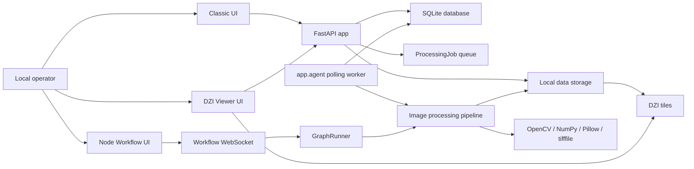
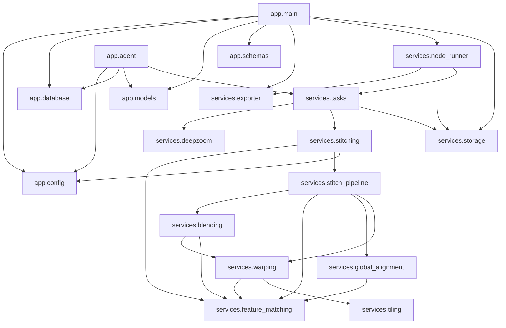
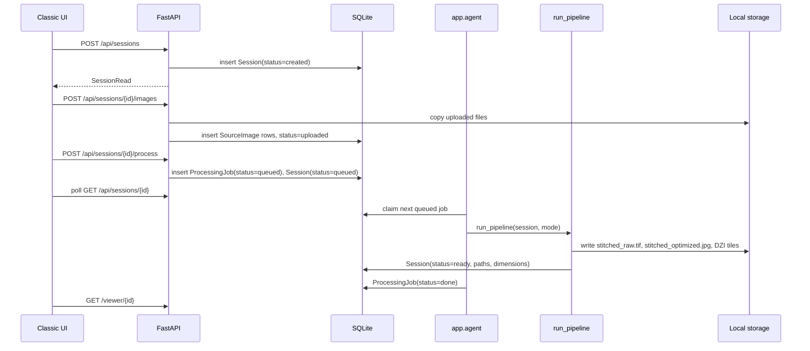
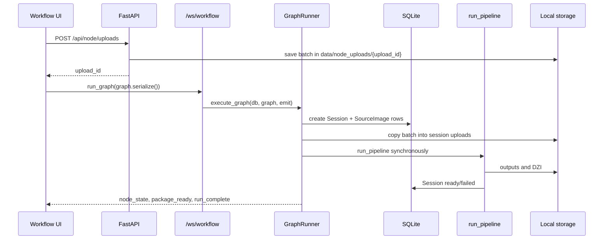
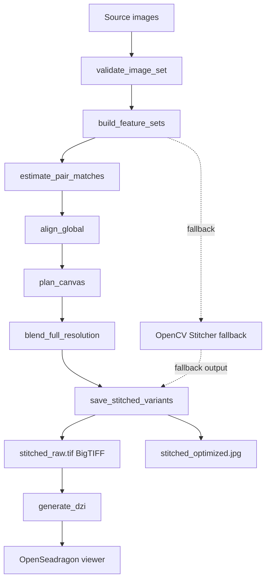
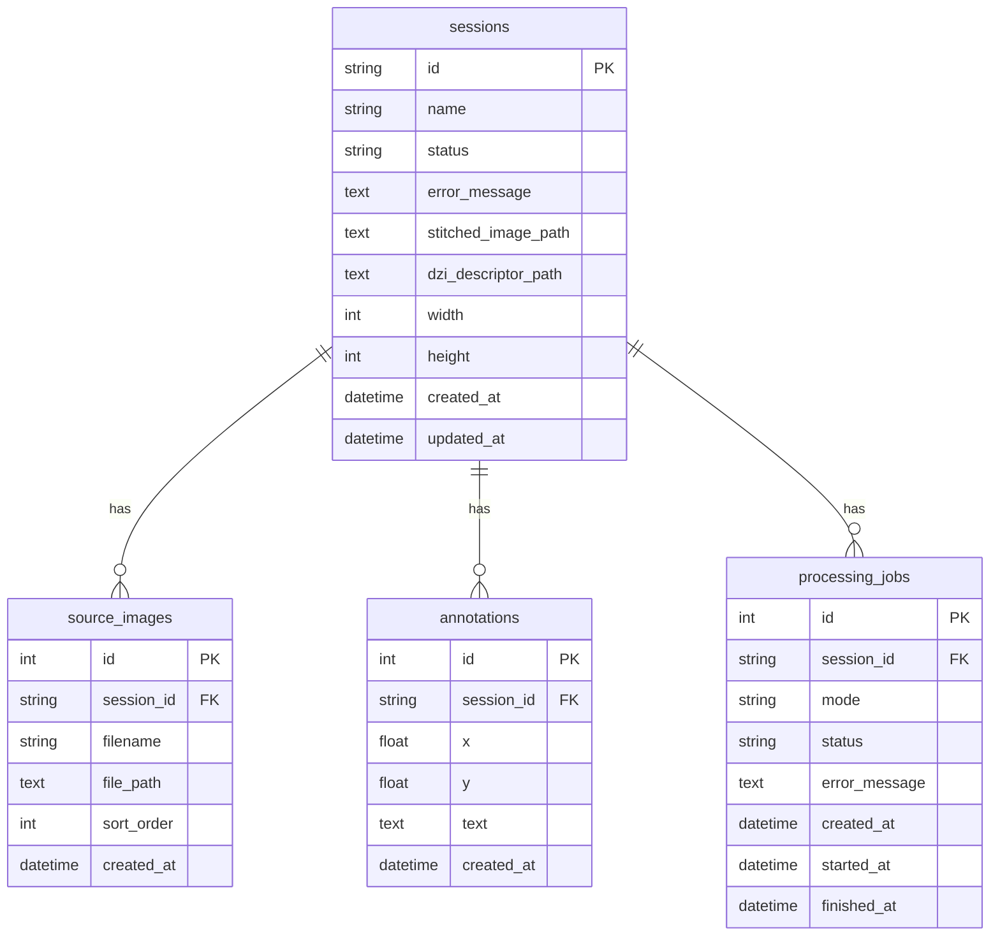
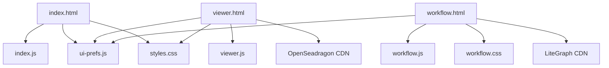

# Codebase Knowledge

Last reviewed: 2026-06-06

## Project Purpose

Hyper Gigapixel Agent (formerly Gigapixel Heritage Viewer) is a local FastAPI web application for heritage image workflows:

- Upload multiple source images.
- Stitch source images into one high-resolution mosaic.
- Save a raw high-resolution BigTIFF and an optimized JPEG.
- Generate Deep Zoom Image tiles for web viewing.
- View, pan, zoom, annotate, and download results.
- Provide both a classic form UI and a node-based workflow UI inspired by ComfyUI, n8n, and agent control panels.

The system is currently optimized for local research and operator-driven use rather than multi-tenant production service operation.

## Runtime Entry Points

| Entry point | Purpose | Notes |
| --- | --- | --- |
| `py -3 -m uvicorn app.main:app --reload` | Starts the FastAPI app | Helper script: `run_api.ps1` |
| `py -3 -m app.agent` | Starts the polling background worker | Helper script: `run_agent.ps1` |
| `open_agent_window.ps1` | Opens a new PowerShell window running the agent | Uses `Start-Process powershell -NoExit` |
| `/` | Classic UI landing page | `main.py` returns `index.html` |
| `/classic` | Explicit classic UI | Same template as `/` |
| `/workflow` | Node workflow UI | Uses LiteGraph from CDN |
| `/viewer/{session_id}` | Deep zoom viewer and annotations | Uses OpenSeadragon from CDN |

## Folder Structure

```text
gigapixel-heritage-viewer/
  app/
    __init__.py
    agent.py                  # Polling worker for queued ProcessingJob rows
    config.py                 # Pydantic settings and data directory setup
    database.py               # SQLAlchemy engine/session/base
    main.py                   # FastAPI app, routes, WebSocket, templates, static files
    models.py                 # SQLAlchemy ORM models
    schemas.py                # Pydantic API schemas
    services/
      blending.py             # Exposure, seam, multiband, feather blending
      deepzoom.py             # DZI tile generation with optional pyvips
      exporter.py             # Raw/optimized download path resolution
      feature_matching.py     # EXIF handling, SIFT/ORB features, pair matching
      global_alignment.py     # Match graph, root selection, affine optimization
      node_runner.py          # Server-side LiteGraph workflow execution
      stitch_pipeline.py      # Modular scans-mode stitching orchestration
      stitching.py            # Public stitching API and BigTIFF/JPEG writers
      storage.py              # Data path helpers
      tasks.py                # Session processing pipeline
      tiling.py               # Canvas size helpers
      warping.py              # Full-resolution warp planning and ROI warping
    static/
      index.js                # Classic UI behavior
      styles.css              # Classic and viewer styles
      ui-prefs.js             # Shared language/theme localStorage helpers
      viewer.js               # OpenSeadragon viewer and annotation behavior
      workflow.css            # Node workflow styles
      workflow.js             # LiteGraph nodes, UX, WebSocket client
    templates/
      index.html
      viewer.html
      workflow.html
  data/
    gigapixel.db              # SQLite runtime database
    node_uploads/             # Temporary workflow upload batches
    sessions/                 # Session uploads, outputs, DZI tiles
  docs/
    CODEBASE_KNOWLEDGE.md
    ARCHITECTURE_AUDIT.md
    REFACTOR_PLAN.md
  README.md
  requirements.txt
  run_api.ps1
  run_agent.ps1
  open_agent_window.ps1
```

## System Context



## Dependency Graph



## API Flow

### Classic queued flow



### Node workflow flow



Important distinction: classic processing uses a queued polling agent. Node workflow processing currently runs the heavy pipeline synchronously inside the WebSocket request lifecycle.

## API Surface

| Method | Path | Responsibility |
| --- | --- | --- |
| `GET` | `/` | Classic UI |
| `GET` | `/classic` | Classic UI |
| `GET` | `/workflow` | Node workflow UI |
| `GET` | `/viewer/{session_id}` | Viewer UI |
| `POST` | `/api/sessions` | Create session |
| `GET` | `/api/sessions/{session_id}` | Read session status |
| `POST` | `/api/sessions/{session_id}/images` | Upload source images |
| `POST` | `/api/sessions/{session_id}/process` | Enqueue background processing |
| `GET` | `/api/sessions/{session_id}/dzi` | Serve DZI descriptor |
| `GET` | `/api/sessions/{session_id}/quality` | Serve the stitch quality report (JSON) |
| `GET` | `/api/sessions/{session_id}/download/enhanced` | Download the AI-enhanced variant |
| `POST` | `/api/sessions/{session_id}/segment` | SAM/GrabCut click-to-segment outline |
| `POST` | `/api/sessions/{session_id}/detect-damage` | Crack/damage region detection |
| `GET` | `/api/sessions/{session_id}/manifest` | Processing manifest (params, versions, SHA-256) |
| `GET` | `/api/sessions/{session_id}/color` | Colour calibration report (dE2000) |
| `GET` | `/api/sessions/{session_id}/provenance` | Provenance summary + layer PNGs |
| `GET` | `/api/sessions/{session_id}/iiif/info.json` | IIIF Image API descriptor |
| `GET` | `/api/sessions/{session_id}/iiif/manifest` | IIIF Presentation manifest |
| `POST` | `/api/sessions/{session_id}/scale` | Dimensional scale calibration |
| `POST` | `/api/sessions/{session_id}/change-detection` | Multi-temporal change detection |
| `POST` | `/api/sessions/{session_id}/focus-stack` | All-in-focus fusion |
| `POST` | `/api/sessions/{session_id}/photometric` | Photometric-stereo normals + albedo |
| `GET` | `/api/sessions/{session_id}/iiif/{region}/{size}/{rotation}/{quality}.{format}` | Live IIIF Image API 3.0 |
| `POST` | `/api/sessions/{session_id}/analyze-condition` | AI crack + discolouration detection |
| `POST` | `/api/sessions/{session_id}/restore` | AI restoration (de-colour/crack/noise) |
| `GET` | `/compare/{session_id}` | Before/After restore comparison page |
| `POST` | `/api/sessions/{session_id}/splat` | Image-to-3D (point cloud + Gaussian PLY) |
| `GET` | `/viewer3d/{session_id}` | WebGL 3D explorer |
| `POST` | `/api/sessions/{session_id}/reconstruct3d` | Multi-view 3D reconstruction |
| `POST` | `/api/sessions/{session_id}/tags` | CLIP/classical auto-tagging |
| `GET` | `/api/search?q=` | Corpus semantic search |
| `POST` | `/api/sessions/{session_id}/coverage-check` | Acquisition coverage QA |
| `GET` | `/api/sessions/{session_id}/queue` | Queue position + job status |
| `POST` | `/api/sessions/{session_id}/outpaint` | Generative border-fill / extend |
| `POST` | `/api/sessions/{session_id}/upscale` | Interactive local upscale (factor) |
| `GET` | `/api/sessions/{session_id}/tiles/{tile_path}` | Serve DZI tile |
| `GET` | `/api/sessions/{session_id}/annotations` | List annotations |
| `POST` | `/api/sessions/{session_id}/annotations` | Create annotation |
| `DELETE` | `/api/annotations/{annotation_id}` | Delete annotation |
| `GET` | `/api/sessions/{session_id}/download` | Backward-compatible raw download |
| `GET` | `/api/sessions/{session_id}/download/raw` | Raw high-resolution image |
| `GET` | `/api/sessions/{session_id}/download/optimized` | Optimized image |
| `POST` | `/api/node/uploads` | Create node upload batch |
| `GET` | `/api/node/uploads` | List node upload batches |
| `WS` | `/ws/workflow` | Node graph execution events |

## Image Processing Flow



### Current scans-mode pipeline

1. `stitch_images()` validates input count.
2. OpenCL is disabled through `disable_opencl()`.
3. For `mode == "scans"` and `settings.stitch_planar_enabled`, `run_scans_pipeline()` is attempted first.
4. `validate_image_set()` reads EXIF orientation and image dimensions.
5. `build_feature_sets()` reads each source image, makes a preview, then extracts SIFT or ORB features.
6. `estimate_pair_matches()` builds pair candidates, performs descriptor matching, and estimates affine or homography transforms with RANSAC.
7. `align_global()` builds an overlap graph, chooses a root image, creates tree transforms, and optionally runs global affine least-squares optimization.
8. `plan_canvas()` projects source corners and allocates a final canvas size.
9. `blend_full_resolution()` performs full-resolution blending:
   - For smaller canvases, it prepares all warped ROIs, applies exposure compensation, graph-cut seams, and multiband blending.
   - For larger canvases, it falls back to streaming feather blending.
9.5. `assess_stitch_quality()` inspects the mosaic (interior holes, coverage,
   sharpness, seams, registration RMS) and, when `stitch_auto_repair` is on,
   `repair_stitch()` inpaints enclosed holes. A `quality_report.json` sidecar is
   written to the session output directory.
10. `save_stitched_variants()` saves BigTIFF raw output and optimized JPEG output.
11. `generate_dzi()` creates Deep Zoom tiles through `pyvips` when available, otherwise through Pillow.
12. If the modular scans pipeline fails, OpenCV `Stitcher` fallback is attempted.

## AI Inference Flow

The registration stage has an **optional learned-matching path** in
`app/services/deep_matching.py`. When `torch` + `kornia` are installed and
`STITCH_MATCHER` is `auto` or a learned backend, image pairs are matched with a
deep model instead of classical descriptors:

- LoFTR (detector-free dense matching) — default `auto` choice, best for
  low-texture, self-similar heritage surfaces.
- DISK / ALIKED / SIFT keypoints combined with LightGlue graph matching.

The learned matcher only replaces correspondence generation. Its output is fed
into the same RANSAC verification (`build_pair_match`), robust global bundle
adjustment, warping, and blending as the classical path. The model is loaded
lazily and the whole module degrades gracefully: if the optional dependencies
or weights are missing, or a run yields too few correspondences to connect the
overlap graph, the pipeline falls back to classical SIFT/ORB matching.

Additional optional AI capabilities, each with a classical fallback:

- `retrieval.py` — DINOv2 (or classical thumbnail) global embeddings choose
  candidate image pairs for large unordered sets.
- `iqa.py` — CLIP-IQA (or heuristic) no-reference quality score feeding QC.
- `segmentation.py` — Segment Anything (or GrabCut) click-segmentation plus
  classical crack/damage detection for viewer annotation.
- `enhance.py` — Real-ESRGAN (or Lanczos+denoise) non-archival enhanced variant.

Archival-science modules (classical core, deep/contrib upgrades optional):

- `color.py` — ColorChecker CCM + CIE dE2000 + FADGI/Metamorfoze grading.
- `provenance.py` — coverage / synthetic / uncertainty layers.
- `manifest.py` — processing manifest, SHA-256 fixity, Dublin Core.
- `scale.py` — ArUco / reference-length dimensional calibration.
- `focus_stack.py` — ECC-aligned Laplacian/wavelet all-in-focus fusion.
- `iiif.py` — IIIF Image + Presentation descriptors.
- `evaluation.py` — known-transform registration benchmark.
- `change_detection.py` — multi-temporal change mapping.
- `photometric.py` — photometric-stereo surface normals + albedo.

Agent-platform modules:

- `iiif.py` — live IIIF Image API 3.0 rendering + descriptors.
- `damage_ai.py` — Hessian-ridge crack + CIELAB discolouration detection.
- `restore.py` — de-colour / de-crack / de-noise restoration.
- `splat.py` — monocular depth -> point cloud + 3D Gaussian Splatting PLY.

Platform-ops modules:

- `jobs.py` / `agent.py` — leases, heartbeat, stale recovery, retries.
- `recon3d.py` — multi-view fusion / COLMAP+gsplat orchestration.
- `semantic.py` — CLIP/classical auto-tags + corpus search.
- `coverage.py` — overlap-graph acquisition QA.
- streaming compositor and optional API-key auth live in `blending.py` / `main.py`.

The remaining computer-vision pipeline uses classical algorithms:

- EXIF orientation normalization through Pillow.
- SIFT or ORB feature detection through OpenCV (fallback / `classic` backend).
- Descriptor matching through BFMatcher or FLANN.
- RANSAC transform estimation.
- Graph-based alignment and Huber IRLS affine bundle adjustment.
- OpenCV warping, exposure/gain compensation, seam finding, and (tiled) multi-band blending.

The node workflow UI has "agent console" behavior, but it does not currently connect to an LLM or external AI agent service.

## Configuration System

Configuration is centralized in `app/config.py` through `pydantic-settings`.

Important settings:

| Setting | Default | Meaning |
| --- | --- | --- |
| `app_name` | `Hyper Gigapixel Agent` | FastAPI app title |
| `api_prefix` | `/api` | API route prefix |
| `data_root` | `PROJECT_ROOT / data` | Runtime storage root |
| `database_path` | `data/gigapixel.db` | SQLite database path |
| `allow_origins` | `["*"]` | CORS allowlist |
| `max_upload_files` | `1000` | Upload batch limit |
| `max_source_pixels` | `10000000000` | Explicit source/canvas pixel limit |
| `tile_size` | `256` | DZI tile size |
| `tile_overlap` | `1` | DZI tile overlap |
| `optimized_jpeg_quality` | `85` | Optimized JPEG quality |
| `raw_stitched_format` | `bigtiff` | Raw output intent |
| `raw_bigtiff_compression` | `none` | BigTIFF compression |
| `stitch_feature_detector` | `sift` | `sift` or `orb` |
| `stitch_planar_enabled` | `True` | Enable modular scans pipeline |
| `stitch_planar_preview_max_dim` | `2200` | Feature preview max dimension |
| `stitch_planar_max_features` | `8000` | Feature count target |
| `stitch_planar_transform_model` | `affine` | `affine`, `similarity`, or `homography` |
| `stitch_planar_multiband_max_pixels` | `120000000` | Multiband vs streaming fallback cutoff |

Configuration values can be overridden with `.env`.

Current side effect: importing `app.config` creates the data root and database parent directory.

## Database Structure



Known statuses in code:

- Session: `created`, `uploaded`, `queued`, `processing`, `ready`, `failed`
- ProcessingJob: `queued`, `processing`, `done`, `failed`

There are no explicit database enum constraints, migrations, job lease fields, retry counters, or structured stage logs.

## Storage Structure

Runtime storage is under `data/`.

```text
data/
  gigapixel.db
  node_uploads/
    {upload_id}/
      00000_filename.ext
      00001_filename.ext
  sessions/
    {session_id}/
      uploads/
        00000_filename.ext
        00001_filename.ext
      output/
        stitched_raw.tif
        stitched_optimized.jpg
        dzi/
          image.dzi
          image_files/
            {level}/
              {col}_{row}.jpg
```

Storage path helpers live in `app/services/storage.py`. They create directories on demand.

## Frontend Structure



Frontend behavior:

- `index.js` creates sessions, uploads images, queues processing, and polls for readiness.
- `viewer.js` polls session status, loads DZI metadata, controls OpenSeadragon, and manages annotations/downloads.
- `workflow.js` registers LiteGraph nodes, manages roles, uploads batches, connects to `/ws/workflow`, and renders agent events.
- `ui-prefs.js` stores language and theme preferences in `localStorage`.

## External Services and Native Dependencies

There are no backend network services required by the Python application.

External browser CDNs:

- LiteGraph CSS and JS from `https://unpkg.com/litegraph.js@0.7.18/...`
- OpenSeadragon JS and image assets from `https://cdnjs.cloudflare.com/...`

Python/native dependencies:

- FastAPI and Uvicorn for web serving.
- SQLAlchemy for ORM.
- Pydantic Settings for configuration.
- OpenCV for feature matching, transforms, warping, seam finding, and blending.
- NumPy for image arrays and linear algebra.
- Pillow for EXIF handling and fallback image IO.
- tifffile for BigTIFF writing.
- pyvips is optional but highly important for production-scale DZI generation.

## Operational Notes

- The classic UI path uses the background worker queue.
- The node workflow path currently bypasses the queue and can run heavy processing in the WebSocket request handler.
- The polling agent processes one job at a time.
- If the agent exits mid-job, a job can remain `processing` indefinitely because there is no heartbeat, lease timeout, or stale-job recovery.
- For gigapixel BigTIFF workloads, `pyvips` should be treated as operationally required, even though the requirement file marks it optional.

