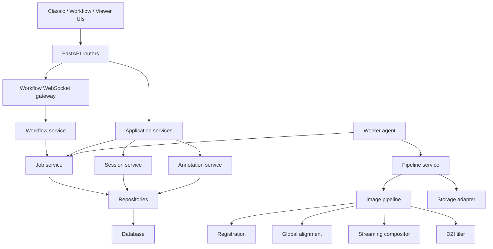

# Refactor Plan

Last reviewed: 2026-06-06

## Refactor Policy

This plan intentionally stops before implementation. The next step should be explicit approval of the plan or a selected phase.

Guiding rules:

- Preserve existing functionality and routes.
- Keep classic UI, node UI, viewer UI, raw/optimized downloads, and scans/panorama modes working.
- Prefer incremental changes behind compatibility wrappers.
- Do not remove fallback paths until tests cover replacement behavior.
- Treat 30,000 x 30,000+ BigTIFF workflows as the production target.

## Proposed Target Architecture

## Phase 0: Safety Baseline Before Refactor

Goal: make current behavior observable and testable before moving architecture.

| Issue | Root cause | Impact | Proposed solution | Risk | Affected files |
| --- | --- | --- | --- | --- | --- |
| Missing tests | Prototype evolved without test harness | Refactor can silently break routes/pipeline | Add pytest, TestClient API tests, storage tests, exporter tests, synthetic pipeline smoke tests | Low | `requirements.txt`, `tests/` |
| Print debugging | Agent uses `print()` | Logs are hard to parse and persist | Add structured logging config and replace prints with logger calls | Low | `app/agent.py`, new `app/logging_config.py` |
| No exception taxonomy | Broad `except Exception` | Cannot recover by failure type | Add `app/errors.py` with `ValidationError`, `PipelineError`, `ResourceLimitError`, `StorageError`, `WorkflowError` | Medium | `app/services/*`, `app/main.py`, `app/agent.py` |
| No stage logs | StageLogger is in memory only | Failures disappear after process exit | Add `processing_events` table or session log file writer; persist stage, level, message, timestamp | Medium | `models.py`, `tasks.py`, `stitch_pipeline.py`, migration |

Acceptance criteria:

- Existing routes still respond.
- `py -3 -m app.agent --once` logs structured messages.
- Failed pipelines store stage-level failure context.
- Basic API tests pass.

## Phase 1: Queue Reliability

Goal: make queued jobs recoverable and understandable.

| Issue | Root cause | Impact | Proposed solution | Risk | Affected files |
| --- | --- | --- | --- | --- | --- |
| Stale processing jobs | No heartbeat or lease | Jobs can remain processing forever | Add `locked_by`, `heartbeat_at`, `attempts`, `max_attempts`; agent updates heartbeat; startup requeues expired jobs | Medium | `models.py`, `agent.py`, `services/job_service.py` |
| Race-prone job claim | Select then update with limited semantics | Multiple workers can race | Implement atomic claim service; for SQLite keep conditional update, for future DB use row locks | Medium | `agent.py`, new `repositories/job_repository.py` |
| Weak status semantics | Strings scattered | Invalid state transitions | Add enums/constants and transition helpers | Low | `models.py`, `schemas.py`, `tasks.py`, `main.py`, `workflow.js` |
| No queue position | API only returns session status | User cannot tell why queued | Add queue metadata to session read or new job status endpoint | Medium | `schemas.py`, `main.py`, `index.js`, `viewer.js` |

Acceptance criteria:

- Killing the agent mid-job no longer blocks a session forever after lease expiry.
- UI can show queue/processing/failed states with clear reason.
- Agent can be restarted safely.

## Phase 2: API and Application Boundary Refactor

Goal: split `app.main` while preserving URLs.

| Issue | Root cause | Impact | Proposed solution | Risk | Affected files |
| --- | --- | --- | --- | --- | --- |
| God module | `main.py` owns too many responsibilities | Poor maintainability | Create routers: `pages`, `sessions`, `uploads`, `workflow`, `dzi`, `annotations`, `downloads` | Medium | `app/main.py`, new `app/api/*.py` |
| Business logic in routes | Routes mutate models directly | Hard to test | Add services: `session_service`, `upload_service`, `download_service`, `annotation_service` | Medium | `app/main.py`, new `app/services/*.py` |
| DB/session direct use everywhere | No repository boundary | Hard to migrate DB or test | Add repository layer for sessions, images, jobs, annotations | Medium | new `app/repositories/*.py` |
| App startup side effects | `create_all` and dirs at import/startup | No explicit lifecycle | Move initialization into `lifespan`; prepare migration path | Medium | `app/main.py`, `app/agent.py`, `config.py` |

Acceptance criteria:

- Public routes remain unchanged.
- `main.py` only constructs app, middleware, static mounts, templates, and includes routers.
- Unit tests can call services without FastAPI request objects.

## Phase 3: Workflow Engine Refactor

Goal: make node execution extensible, typed, and queue-backed.

| Issue | Root cause | Impact | Proposed solution | Risk | Affected files |
| --- | --- | --- | --- | --- | --- |
| `GraphRunner` God class | Nodes implemented as `if node_type` chain | Hard to add node library | Introduce `NodeExecutor` protocol and registry | Medium | `services/node_runner.py`, new `workflow_nodes/` |
| Ad hoc types | Link types are mostly UI hints | Runtime type errors | Define shared node schemas and port types | Medium | `workflow.js`, backend registry |
| WebSocket runs heavy jobs | Pipeline called directly | Disconnect/blocking risk | `workflow/run_pipeline` should enqueue a job and stream job status events | High | `node_runner.py`, `main.py`, `agent.py`, frontend |
| Backend/frontend node drift | Node library duplicated | Inconsistent UX | Generate frontend node library metadata from backend registry endpoint | Medium | `main.py`, `workflow.js`, new registry |

Acceptance criteria:

- Existing default graph still works.
- Multiple start nodes still work.
- Pipeline execution from workflow uses the same job system as classic mode.
- WebSocket can reconnect and resume status by job/session id.

## Phase 4: Gigapixel Image Pipeline Memory Refactor

Goal: avoid requiring the full final mosaic in RAM.

| Issue | Root cause | Impact | Proposed solution | Risk | Affected files |
| --- | --- | --- | --- | --- | --- |
| Full mosaic array | Blending returns `np.ndarray` | RAM exhaustion | Introduce streaming/tiled compositor that writes BigTIFF tiles/strips directly | High | `blending.py`, `warping.py`, `stitching.py`, new `compositor.py` |
| Full-image preview reads | `read_image_bgr` before preview | Unnecessary memory | Use Pillow thumbnail or pyvips/OpenCV reduced reads for feature previews | Medium | `feature_matching.py` |
| Pillow DZI fallback unsafe | Full source conversion | Memory failure | Make pyvips/libvips a required production dependency; keep Pillow fallback only below threshold | Medium | `deepzoom.py`, docs, installer |
| Optimized download regeneration in request | Lazy generation during GET | Slow requests | Generate optimized output during job or enqueue regeneration job | Medium | `exporter.py`, `tasks.py`, downloads route |
| No resource budgets | Pixel count only | Jobs can pass but crash | Add memory estimator using canvas, masks, bands, source count; reject or switch to streaming mode | Medium | `tiling.py`, `stitch_pipeline.py`, `blending.py` |

Acceptance criteria:

- A 30,000 x 30,000 target can be written as BigTIFF without holding the entire final RGB image plus copies in memory.
- DZI generation for production path uses pyvips streaming.
- Pipeline logs selected memory mode and estimated peak memory.

## Phase 5: Image Quality and Alignment Hardening

Goal: improve PTGui-like results without hiding errors through downscaling.

| Issue | Root cause | Impact | Proposed solution | Risk | Affected files |
| --- | --- | --- | --- | --- | --- |
| Affine optimizer only | Current global optimizer is affine least squares | Some lens/perspective cases remain imperfect | Add robust loss and optional homography/camera model optimization | High | `global_alignment.py` |
| No lens/vignetting model | Exposure compensation only after warp | Residual brightness seams | Add optional gain blocks and vignetting compensation | Medium | `blending.py`, new `exposure.py` |
| Seam fallback quality | Large canvases use feather fallback | Seams can be visible | Add tile-aware seam masks or chunked multiband blending | High | `blending.py`, new `seams.py` |
| No benchmark image sets | Manual quality judgment | Regressions hard to detect | Add synthetic overlap tests plus documented 10/30/50 real test protocol | Medium | `tests/`, `docs/TESTING_GUIDE.md` |

Acceptance criteria:

- Pipeline reports accepted pairs, graph connectivity, root, RMS, seam mode, and blend mode.
- Test image sets can be compared before/after by objective metrics and visual review.

## Phase 6: Security and Storage Controls

Goal: make local-first operation safer and prepare for controlled deployment.

| Issue | Root cause | Impact | Proposed solution | Risk | Affected files |
| --- | --- | --- | --- | --- | --- |
| CORS wildcard | Local prototype default | Unsafe if exposed | Default to localhost origins; document override | Low | `config.py`, deployment docs |
| No auth | Local app assumption | Uncontrolled access | Add optional local token auth for API and WebSocket | Medium | `main.py`, routers, frontend |
| Weak upload validation | Count and filename only | Bad files reach CV stack | Validate extension, MIME, magic bytes, dimensions, size, and pixel limits | Medium | upload service |
| Broad image `.gitignore` | Runtime artifacts mixed with source concerns | Assets/test fixtures hidden | Normalize `.gitignore` to ignore runtime dirs, not all image files | Low | `.gitignore` |

Acceptance criteria:

- Server rejects non-image uploads before storage or processing.
- Docs clearly state local-only vs network deployment mode.

## Phase 7: Documentation and Deployment

Goal: support professional handoff and repeatable setup.

| Issue | Root cause | Impact | Proposed solution | Risk | Affected files |
| --- | --- | --- | --- | --- | --- |
| README drift | Features evolved quickly | User confusion | Update README route map and workflow modes | Low | `README.md` |
| Missing deployment docs | Local scripts only | Hard to reproduce | Add `DEPLOYMENT_GUIDE.md` with Python, libvips, Windows notes | Low | `docs/DEPLOYMENT_GUIDE.md` |
| No testing guide | No test strategy | Fragile QA | Add `TESTING_GUIDE.md` | Low | `docs/TESTING_GUIDE.md` |
| No performance report | No benchmarks yet | Cannot prove improvements | Add benchmark harness and `PERFORMANCE_REPORT.md` after baseline run | Medium | `docs/PERFORMANCE_REPORT.md`, `scripts/benchmarks/` |
| No roadmap | Requirements spread across conversation | Prioritization drift | Add `FUTURE_ROADMAP.md` | Low | `docs/FUTURE_ROADMAP.md` |

Acceptance criteria:

- A new developer can install, run API, run agent, process a sample set, run tests, and understand known limits.

## Recommended Implementation Order

1. Approve this plan and freeze public route behavior for compatibility.
2. Add tests and structured logging before architectural moves.
3. Add queue lease/heartbeat/stale recovery because it addresses immediate operational pain.
4. Split `main.py` into routers and services while tests protect routes.
5. Refactor workflow execution so node UI also uses queued jobs.
6. Replace full-image output path with streaming/tiled BigTIFF and pyvips-first DZI.
7. Harden upload security, auth, and deployment settings.
8. Add performance benchmarks and publish final reports.

## Deferred Documents

The following requested documents should be generated after the relevant implementation or benchmark steps are complete:

- `docs/REFACTOR_SUMMARY.md`: after code refactor is implemented.
- `docs/PERFORMANCE_REPORT.md`: after baseline and post-refactor benchmarks are run.
- `docs/TESTING_GUIDE.md`: after test harness exists.
- `docs/DEPLOYMENT_GUIDE.md`: after dependency and libvips strategy is finalized.
- `docs/FUTURE_ROADMAP.md`: after the implementation scope is approved.

Creating those now as final documents would be speculative, so they are intentionally deferred until the plan is approved.

